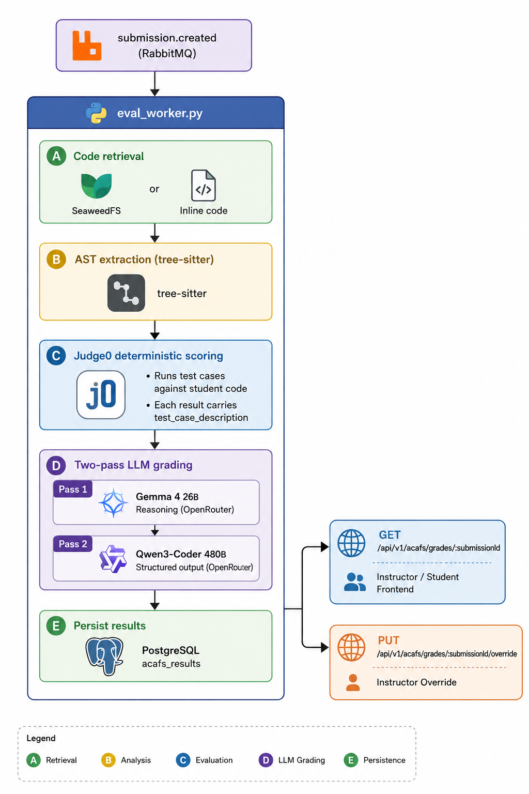

# ACAFS Grading Pipeline

This document describes how ACAFS evaluates a student code submission end-to-end,
from the moment the RabbitMQ event arrives to when the grade is persisted and
queryable via REST.

---

## Pipeline Overview



---

## Step A — Code Retrieval

The worker first checks whether the `SubmissionEvent` carries inline `code`.
If absent, it fetches the source file from MinIO at `storage_path`.
Code exceeding `AST_MAX_LINES` is truncated; the `ast_truncated` flag is set.

---

## Step B — AST Extraction

tree-sitter parses the code within a `AST_TIMEOUT_SECONDS` wall-clock timeout.
The resulting blueprint (functions, classes, variables, control flow, imports)
is serialised to JSONB and stored alongside the grade.

Supported languages: C, C++, Java, Python, JavaScript, C#.

---

## Step C — Deterministic Test-Case Scoring

Each test case from the `SubmissionEvent` is submitted to Judge0.
The result object stored for each test case includes:

| Field | Description |
|---|---|
| `test_case_id` | UUID of the test case |
| `test_case_description` | Human-readable name set by the instructor |
| `passed` | `true` / `false` |
| `stdin` | Input sent to Judge0 |
| `expected_output` | Expected stdout |
| `actual_output` | Actual stdout |
| `status` | Judge0 status label (e.g. `Accepted`, `Runtime Error (NZEC)`) |
| `time` | Execution time (seconds) |
| `memory` | Peak memory (KB) |

Criteria with `grading_mode: "deterministic"` receive a score derived from
`weight × (passed / total)` before the LLM is invoked.

---

## Step D — Two-Pass LLM Grading

### Why two passes?

A single LLM call producing both reasoning and structured JSON reliably tends
toward grade inflation and shallow justifications. Separating *reasoning* from
*scoring* produces more calibrated, evidence-linked grades.

### Pass 1 — Gemma 4 26B (Reasoning)

- **Model**: `google/gemma-4-26b-a4b-it:free` via OpenRouter
- **Env var**: `ACAFS_REASONER_MODEL`
- **Input**: student code, rubric criteria with band definitions, Judge0 results
  (referenced by `test_case_description`, never raw UUID), AST blueprint summary,
  assignment objective
- **Output**: free-form chain-of-thought reasoning — the model thinks through each
  criterion, identifies evidence, considers the appropriate band, and flags any
  uncertainty

The reasoning trace is **not** stored permanently — it is only passed to Pass 2.

### Pass 2 — Qwen3-Coder 480B (Structured Output)

- **Model**: `qwen/qwen3-coder-480b-a35b-instruct` via OpenRouter
- **Env var**: `ACAFS_GRADER_MODEL`
- **Input**: Pass 1 reasoning trace + original rubric + test results
- **Output**: strict JSON conforming to the grade schema (see below)

Qwen3-Coder is instructed to treat the Gemma 4 reasoning as authoritative evidence
and produce the final numeric scores, band selections, confidence values,
per-criterion reasons, and holistic Markdown feedback.

### Grade JSON produced by Pass 2

```json
{
  "criteria_scores": [
    {
      "name": "Recursive base case handling",
      "score": 15,
      "max_score": 20,
      "grading_mode": "deterministic",
      "reason": "Passed 3/4 test cases. 'Handles negative input' failed — function returned None instead of 0.",
      "band_selected": "good",
      "confidence": 0.92
    }
  ],
  "holistic_feedback": "## What you achieved\n\nYour `add_numbers` function ...\n\n## What to improve\n\n...\n\n## Next step\n\n..."
}
```

### Fallback / mock mode

If `ACAFS_OPENROUTER_API_KEY` is blank, `None`, or matches a known placeholder
string, the pipeline falls back to a deterministic mock response. This prevents
a silent bad-key from causing empty or inflated grades in development environments.

---

## Step E — Persistence

The final grade is upserted into `acafs_results` via `postgres_client.py`.
The row includes all Pass 2 fields plus the raw Judge0 execution data in
`grading_metadata`.

---

## Instructor Override

After grading, instructors may apply overrides via:

```
PUT /api/v1/acafs/grades/:submissionId/override
```

Overrides are stored in dedicated columns (`instructor_override_score`,
`instructor_holistic_feedback`, `override_by`, `overridden_at`) and are **never**
written back to the AI-generated columns. The frontend displays both scores,
with the override taking precedence in the displayed total.

### Override request body

```json
{
  "criteria_overrides": [
    {
      "criterion_name": "Recursive base case handling",
      "override_score": 18,
      "override_reason": "Student demonstrated correct logic in oral examination."
    }
  ],
  "instructor_holistic_feedback": "Well done overall. Pay attention to edge cases.",
  "override_by": "dr.smith@university.edu"
}
```

All fields are optional — submit only what needs to change.

---

## Holistic Feedback Format

The `holistic_feedback` field is **Markdown** and is structured around the
Hattie & Timperley (2007) Feed Up / Feed Back / Feed Forward framework:

```markdown
## What you achieved
<Feed Up — acknowledges what the submission did well>

## What to improve
<Feed Back — identifies the specific gap, references test case names or constructs>

## Next step
<Feed Forward — one concrete, actionable question or suggestion>
```

The frontend renders this with `react-markdown` + `remark-gfm` and
`@tailwindcss/typography` prose styles.

---

## Confidence Scoring

Each criterion score carries a `confidence` value (0.0–1.0).
Values below **0.6** are flagged in the instructor view with a warning badge,
indicating the grade should be manually reviewed.

Confidence is low when:
- The model's reasoning contradicted available test evidence
- The submission was syntactically valid but behaviourally ambiguous
- The criterion had no associated test cases and relied purely on LLM judgment

---

## Environment Variable Reference

| Variable | Purpose |
|---|---|
| `ACAFS_OPENROUTER_API_KEY` | **Single secret** — OpenRouter key for Pass 1 + Pass 2 + Socratic chat |
| `ACAFS_REASONER_MODEL` | Pass 1 model (default: `google/gemma-4-26b-a4b-it:free`) |
| `ACAFS_GRADER_MODEL` | Pass 2 model (default: `qwen/qwen3-coder-480b-a35b-instruct`) |
| `ACAFS_CHAT_MODEL` | Socratic chat model (default: `z-ai/glm-4.5-air:free`) |
