# GradeLoop Core v2 — database ER overview

This document maps **PostgreSQL** schemas used by the monorepo. The stack is **multi-database**: foreign keys never cross database boundaries. Many columns store **UUIDs or text IDs** that logically reference another service; those links are summarized in the **logical** diagram at the end, not as `erDiagram` relationships.

**Conventions**

- **PK** / **FK** in attribute lists reflect **enforced** keys in code (GORM / SQLAlchemy / `CREATE TABLE`) as read from the repo at authoring time.
- **UUID logical ref** = no DB-level FK; resolved at application layer.
- **Soft delete**: IAM `users` uses GORM `DeletedAt`; academic tables may use nullable `deleted_at`.
- **JSONB** columns are collapsed to a single attribute line where useful for readability.
- **Mermaid diagrams** in this file share a `theme: base` init tuned for **light** backgrounds (high-contrast text and lines). In dark-themed editors, you may prefer local overrides or switching the diagram theme.

---

## Inventory

| Database (typical `*_SVC_DB_NAME`) | Owning area | Authoritative sources |
|-----------------------------------|-------------|------------------------|
| `iam_db` | IAM service | [`apps/services/iam/internal/domain/models.go`](../apps/services/iam/internal/domain/models.go) |
| `academic_db` | Academic service | [`apps/services/academic/internal/domain/`](../apps/services/academic/internal/domain/) |
| `assessment_db` | Assessment service | [`apps/services/assessment/internal/domain/`](../apps/services/assessment/internal/domain/) |
| `acafs_db` | ACAFS service | [`apps/services/acafs/app/models.py`](../apps/services/acafs/app/models.py), [`postgres_client.py`](../apps/services/acafs/app/services/storage/postgres_client.py) |
| `email_db` | Email service | [`apps/services/email/internal/domain/models.go`](../apps/services/email/internal/domain/models.go) |
| `notification_db` | Notification service | [`apps/services/notification/internal/domain/models.go`](../apps/services/notification/internal/domain/models.go) |
| `cipas_db` | CIPAS Syntactics (shared DB name in compose) | [`apps/services/cipas-syntactics/models.py`](../apps/services/cipas-syntactics/models.py) |
| `cipas_ai_db` | CIPAS AI (inference) | No relational app schema — PyTorch models only ([`apps/services/cipas-ai/src/models.py`](../apps/services/cipas-ai/src/models.py)) |
| `keystroke-db` | Keystroke service (separate Postgres instance in compose) | [`apps/services/keystroke/schema.sql`](../apps/services/keystroke/schema.sql) |
| `ivas_db` | IVAS (optional / when deployed) | [`apps/services/ivas/app/services/storage/postgres_client.py`](../apps/services/ivas/app/services/storage/postgres_client.py) (`SCHEMA_SQL`) |

---

## `iam_db` — IAM service

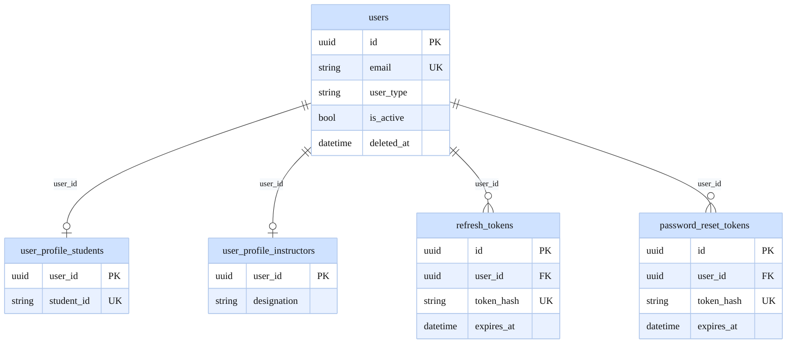

---

## `academic_db` — Academic service

The schema is split into **two** ER diagrams so each renders larger in viewers (GitHub, VS Code, Mermaid Live Editor). Use **SVG export** or zoom if text still feels small: `npx @mermaid-js/mermaid-cli -i docs/database-er.md -o out.svg` (see [Drift and tooling](#drift-and-tooling)).

### A — Org structure, degrees, batches, cohort membership

Logical IAM link: `batch_members.user_id` → `users.id` (no FK in this database).

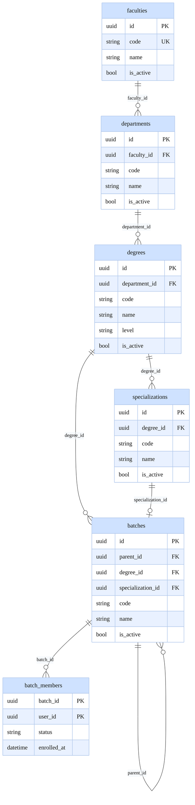

### B — Course catalog, prerequisites, offerings, instructors, enrollments

Logical links (no FK in `academic_db`): `course_instances.course_id` → `courses.id`, `course_instances.semester_id` → `semesters.id`, `course_instructors.user_id` and `enrollments.user_id` → IAM `users.id`.

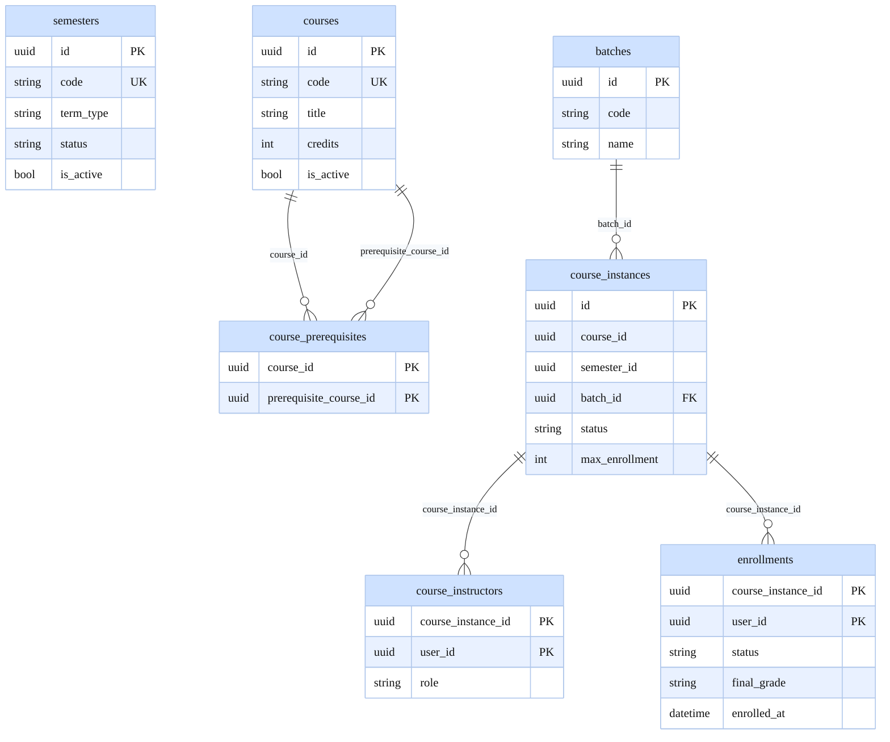

`batches` is repeated in **diagram B** with only key columns so `course_instances` → `batches` can be drawn; the full batch hierarchy stays in **diagram A**.

| Table | Primary key | Foreign keys (enforced in DB) |
|-------|-------------|-------------------------------|
| `faculties` | `id` | — |
| `departments` | `id` | `faculty_id` → `faculties` |
| `degrees` | `id` | `department_id` → `departments` |
| `specializations` | `id` | `degree_id` → `degrees` |
| `batches` | `id` | `parent_id` → `batches`, `degree_id` → `degrees`, `specialization_id` → `specializations` |
| `batch_members` | (`batch_id`, `user_id`) | `batch_id` → `batches` |
| `semesters` | `id` | — |
| `courses` | `id` | — |
| `course_prerequisites` | (`course_id`, `prerequisite_course_id`) | both → `courses` |
| `course_instances` | `id` | `batch_id` → `batches` |
| `course_instructors` | (`course_instance_id`, `user_id`) | `course_instance_id` → `course_instances` |
| `enrollments` | (`course_instance_id`, `user_id`) | `course_instance_id` → `course_instances` |

---

## `assessment_db` — Assessment service

GORM does not tag these structs with `foreignKey`, so Postgres may or may not enforce referential integrity; the lines below show **application-level** relationships (same as service joins).

Entity **`assignment_groups`** is the ER label for the physical table **`groups`** (`SubmissionGroup` in Go) — the name `groups` is avoided in Mermaid because it can break parsers.

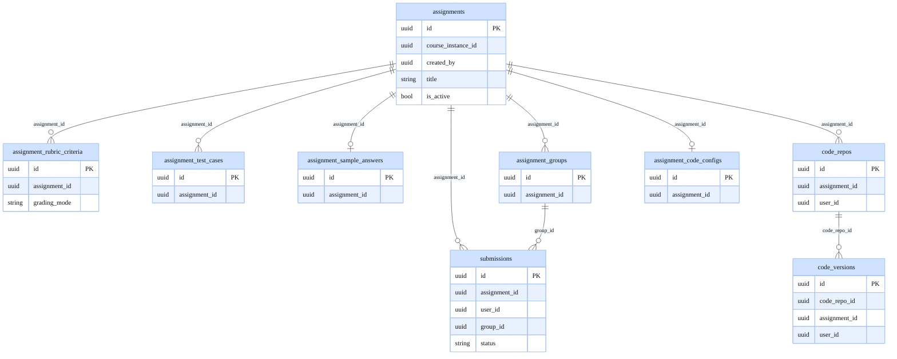

Physical table name for cohorts: **`groups`**. `assignment_sample_answers.assignment_id` and `assignment_code_configs.assignment_id` are unique at most one row per assignment in normal use.

---

## `acafs_db` — ACAFS service

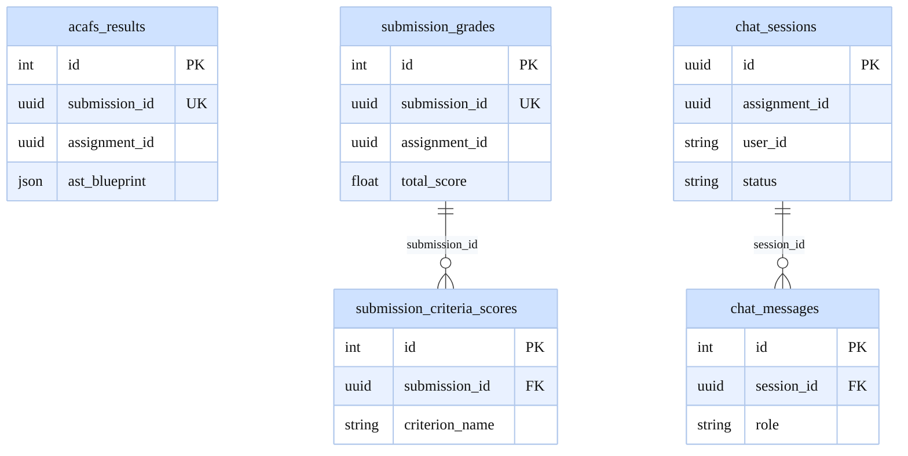

---

## `email_db` — Email service

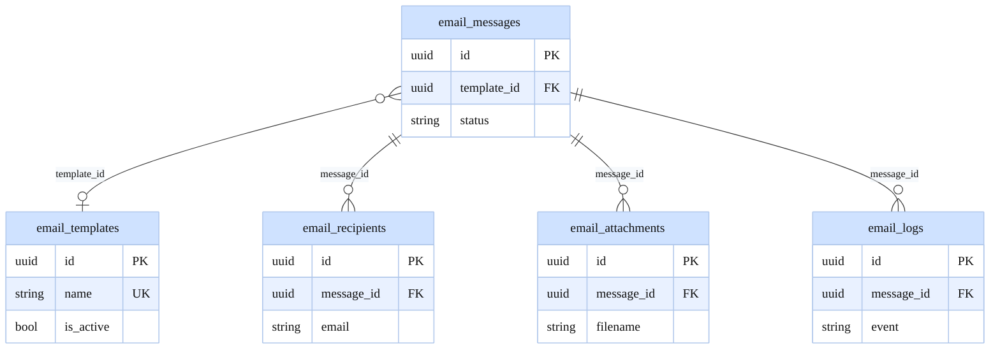

`email_messages.template_id` is nullable; cardinality uses `}o--o|` to `email_templates`.

---

## `notification_db` — Notification service

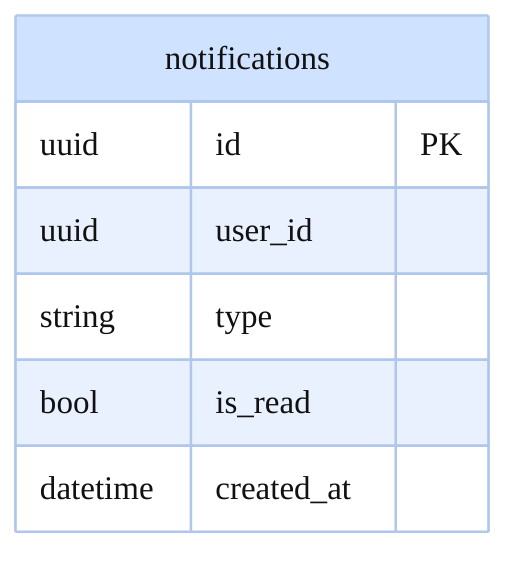

The database column is `read` (Go `Read`); the diagram uses `is_read` because `read` can clash with Mermaid grammar in some parsers.

---

## `cipas_db` — CIPAS Syntactics

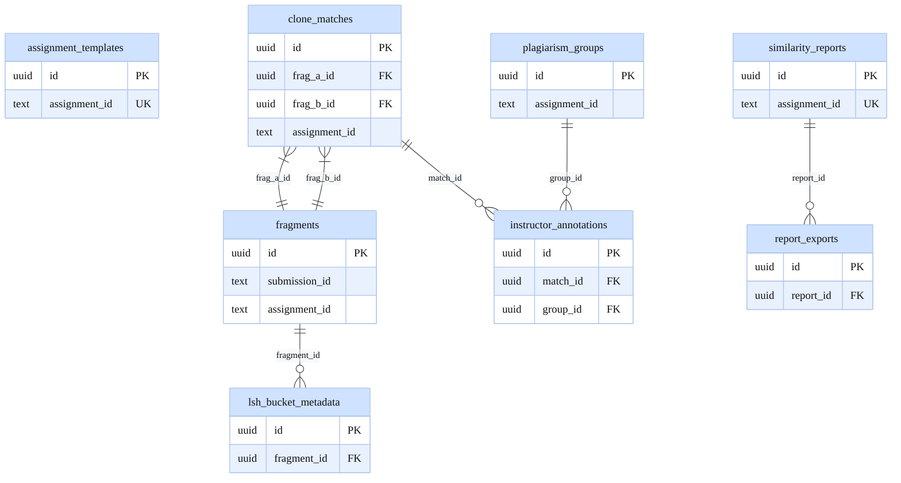

`assignment_templates`, `fragments`, `plagiarism_groups`, and `similarity_reports` reference **assessment** entities by **text UUID** only (no cross-database FK).

---

## `cipas_ai_db`

No first-party relational tables for application data — the service loads **ML weights** for inference. Compose may still provision an empty database URL for operational symmetry.

---

## Keystroke database (`keystroke-db`)

Tables are independent; **no enforced FKs** between `user_biometrics`, `auth_events`, `keystroke_archives`, and `enrollment_progress`. Links are by `user_id` / `session_id` / `assignment_id` strings.

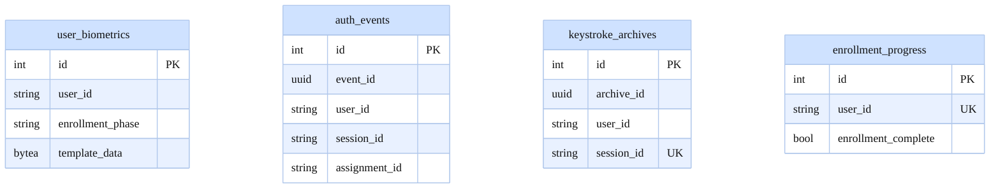

---

## `ivas_db` — IVAS (when enabled)

Schema is defined in **embedded SQL** in the IVAS Postgres client. IVAS **`assignments`** / **`grading_criteria`** / **`questions`** are **not** the same tables as assessment `assignments`.

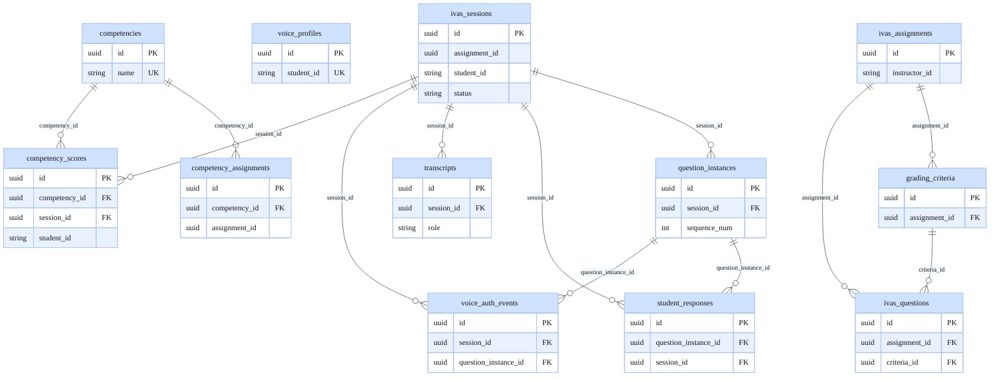

Entity names `ivas_assignments` and `ivas_questions` are **aliases** in this diagram only; physical table names are `assignments` and `questions` inside `ivas_db`.

---

## Logical cross-service references (not enforced in SQL)

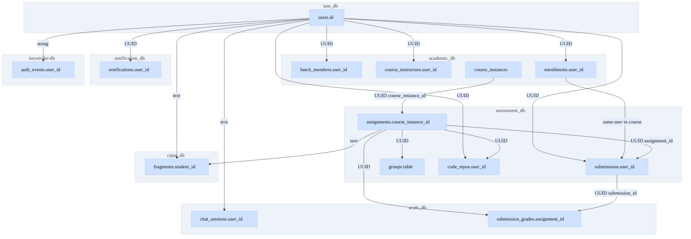

---

## Drift and tooling

- **Drift**: If migrations or `AutoMigrate` change without updating this file, diagrams become stale. Prefer updating this doc when domain models change.
- **Optional automation**: [Mermaid CLI](https://github.com/mermaid-js/mermaid-cli) (`mmdc`) for PNG/SVG, or [tbls](https://github.com/k1LoW/tbls) against a live database for diff checks.
